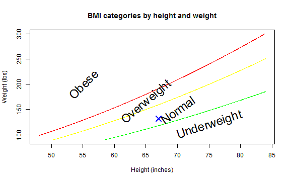

## What is BMI

1. BMI stands for Body Mass Index
2. It is a measure of relative weight based on an individual's mass and height.
3. A simple method to assess how much an individual's body weight departs from what is normal or desirable for a person of his or her height.

--- 

## Why you should be aware of your BMI

1. BMI is a better predictor of disease risk than body weight alone.

2. If your BMI is high, you may have an increased risk of developing certain diseases such as: high blood pressure, heart disease, high cholesterol and blood lipids (LDL), Type 2 Diabetes, sleep apnea, osteoarthritis, female infertility, , gastroesophageal reflux (GERD), urinary stress incontinence.

3. Prevention of further weight gain is important and weight reduction is desirable. 

4. The BMI for children and teens is calculated the same way. But you must put the BMI on a growth chart to find out what it means.

--- 

## How do I find out my BMI

The formula for BMI is $$\frac{weight}{height^2}$$ for metric valuse and $$\frac{weight}{height^2}*703$$ for english ones.

In order to find out your value in an easy way I've created a Shiny app to do just that.

---
## BMI Shiny App
The App lets you enter your heignt and weight in either metric (meters and kg) or english (ft and in and lb) units. Then it calculates your BMI, lets you know where you fall in the categories and displays your result on a chart. For example, if you enter height: 1.70 m and weight 60 kg you will get the following result:

```
## [1] 19.59
```
And it will be displayed in a chart:
 
